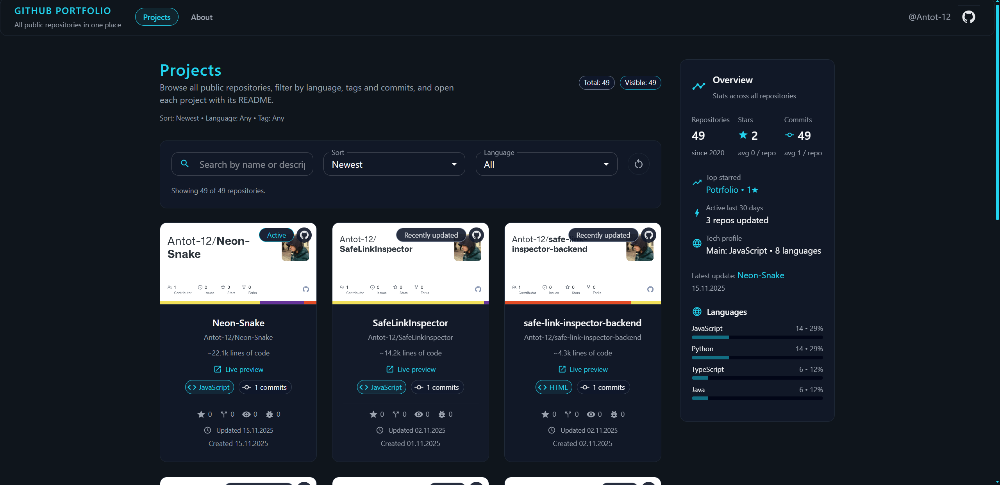

# 🚀 GitHub Neon Portfolio

A personal project that turns your public GitHub repositories into a portfolio website.  




---

## 📖 Table of contents

- [🚀 GitHub Neon Portfolio](#-github-neon-portfolio)
- [📖 Table of contents](#-table-of-contents)
- [🌟 Features](#-features)
  - [Projects grid](#projects-grid)
  - [Sidebar overview](#sidebar-overview)
  - [Keyboard shortcuts](#keyboard-shortcuts)
- [🛠 Tech stack](#-tech-stack)
- [📦 Getting started](#-getting-started)
  - [1. Clone the repo](#1-clone-the-repo)
  - [2. Install dependencies](#2-install-dependencies)
  - [3. Configure environment variables](#3-configure-environment-variables)
  - [4. Run in development](#4-run-in-development)
  - [5. Build for production](#5-build-for-production)
- [🌐 Deploying to GitHub Pages](#-deploying-to-github-pages)
- [📁 Project structure](#-project-structure)
- [⚙️ GitHub API & caching](#️-github-api--caching)
- [🎨 Design & UX details](#-design--ux-details)

---

## 🌟 Features

### Projects grid

The main `/` page shows all your public repos as cards:

- 🧱 **Neon repo cards** with:
  - Name, full name (`owner/name`)
  - Description
  - Language chip
  - Small **commits** chip
  - Stats row: ⭐ stars, 🍴 forks, 👁️ watchers, 🐞 open issues
  - Activity badge:
    - `Active` (updated ≤ 14 days)
    - `Recently updated` (≤ 60 days)
    - `Legacy` (older repos)
  - “Live preview” link if repo has `homepage` set
- 🖼 **Preview image** using GitHub OpenGraph  
- 🏷 Top GitHub **topics** rendered as neon chips
- 🎯 **Click on topic** on a card → filters the main list by this tag

Other grid features:

- 🔍 Text search by repo **name / description**
- 🧪 Filters:
  - by **language**
  - by **tag/topic**
- 🔁 Sorting:
  - `Newest`
  - `Oldest`
  - `Most commits`
  - `Fewest commits`
- 📄 Pagination with page number stored in URL & localStorage:
  - You can open a repo, go back, and stay on the same page & filters

---

### Sidebar overview

On the right side of the list page there is a sticky **Overview** panel with:

- 📦 Total repositories (with “since YEAR”)
- ⭐ Total stars + average stars per repo
- 🧾 Total commits + average commits per repo
- ⚡ Repos active in the last 30 days
- 🏆 Top starred repo (name + stars, clickable)
- 🕒 Latest updated repo (name + date, clickable)
- 🌐 Tech profile:
  - Primary language
  - Total languages used
- 🧮 Language breakdown:
  - Up to 4 top languages with percentage bars
  - Bars are clickable: click a language → apply language filter

This gives a quick “portfolio overview” of what you actually build.

---

### Keyboard shortcuts

To make the app feel more “developer friendly”, the following shortcuts are supported on the **projects list** page:

* `/` - focus the **Search** input (like GitHub / VS Code)
* `Esc` - clear the search text
* `←` / `→` - go to **previous / next page** in pagination
* `j` / `k` - move selection between cards (optionally highlight the active card / scroll it into view)

These shortcuts make browsing many repositories much faster once you get used to them.

---

## 🛠 Tech stack

* ⚛️ **React** (SPA)
* ⚡ **Vite** (dev server + build)
* 🎨 **Material UI (MUI)** for UI components and theming
* 🧭 **React Router** for navigation
* 🧠 **React Context** (`GithubContext`) for sharing GitHub data
* 📝 `react-markdown` + `remark-gfm` + `rehype-raw` for README rendering
* 🎬 **framer-motion** for transitions and micro-animations

---

## 📦 Getting started

### 1. Clone the repo

```bash
git clone https://github.com/Antot-12/github-neon-portfolio.git
cd github-neon-portfolio
```

### 2. Install dependencies

```bash
npm install
# or
yarn
```

### 3. Configure environment variables

Create a `.env` file in the project root (next to `package.json`):

```bash
cp .env.example .env
```

Then open `.env` and set:

```env
VITE_GITHUB_USERNAME=your-github-username
VITE_GITHUB_TOKEN=your_personal_access_token
```

* `VITE_GITHUB_USERNAME` - which GitHub user’s public repositories to display
* `VITE_GITHUB_TOKEN` - optional **Personal Access Token** (no special scopes needed, `read-only` is fine).
  This increases rate limits above the default 60 requests/hour.

### 4. Run in development

```bash
npm run dev
# or
yarn dev
```

Open the dev server URL (usually `http://localhost:5173`).

### 5. Build for production

```bash
npm run build
npm run preview
```

* `npm run build` → generates optimized static files in `dist`
* `npm run preview` → serves the built app locally

---

## 🌐 Deploying to GitHub Pages

One simple way to deploy:

1. Push this repo to GitHub
2. In the repository **Settings → Pages**:

  * Choose **Source**: GitHub Actions or `gh-pages` branch
3. If the app is served from a subpath (e.g. `/github-neon-portfolio`), set `base` in `vite.config.js`:

```js
export default defineConfig({
  base: '/github-neon-portfolio/',
  // ...
})
```

---

## 📁 Project structure

Rough overview of the main files:

```txt
github-neon-portfolio/
├─ public/
│  ├─ no_image.jpg              # Fallback preview for repo cards
│  └─ preview.png               # Screenshot used in README
├─ src/
│  ├─ App.jsx                   # App shell, header, routes
│  ├─ main.jsx                  # React entry point
│  ├─ GithubContext.jsx         # GitHub API, caching, global state
│  ├─ index.css                 # Global styles (body, scrollbar, markdown)
│  ├─ components/
│  │  ├─ RepoCard.jsx           # Single repo card with metrics & links
│  │  ├─ RepoGrid.jsx           # Animated grid of cards
│  │  ├─ RepoFilters.jsx        # Search, filters, sort UI
│  │  ├─ SidebarStats.jsx       # Overview stats sidebar on list page
│  │  ├─ ScrollProgressBar.jsx  # Global scroll progress bar (list page)
│  │  ├─ LoadingOverlay.jsx     # Fullscreen loading spinner + text
│  │  └─ ErrorOverlay.jsx       # Fullscreen error message
│  ├─ pages/
│     ├─ AboutSection.jsx       # About & Skills block on the homepage
│     │  RepoListPage.jsx       # Main projects page (grid + filters + stats)
│     └─ RepoDetailPage.jsx     # Detail page with README + Project overview + TOC
│
├─ .env.example                 # Sample env variables
├─ package.json
├─ vite.config.js
└─ README.md
```

---

## ⚙️ GitHub API & caching

### Repos loading

`GithubContext.jsx`:

* Reads `VITE_GITHUB_USERNAME` and `VITE_GITHUB_TOKEN`

* Fetches repositories from:

  ```txt
  https://api.github.com/users/:username/repos?per_page=100&sort=updated
  ```

* Normalizes each repo to an internal object with:

  * `id`, `name`, `full_name`, `description`, `html_url`
  * `language`, `topics`
  * `stargazers_count`, `forks_count`, `open_issues_count`, `watchers_count`
  * `created_at`, `updated_at`, `pushed_at`
  * `homepage`
  * `commitsCount`
  * `ownerLogin`
  * `size`

### Commits count

For each repo it tries to approximate the number of commits by hitting:

```txt
https://api.github.com/repos/:owner/:repo/commits?per_page=1
```

* If the `Link` header contains `rel="last"`, it extracts the page number to get total commits
* Otherwise it falls back to the length of the returned array

### Local caching

To avoid hitting the API on every refresh:

* The full repos array is cached in `localStorage` under a key like:

  ```txt
  githubPortfolio:<username>:repos
  ```

* A simple TTL (e.g. 5 minutes) is used

* The `refresh()` method in context can be used to force refetch

---

## 🎨 Design & UX details

Some notable UX details:

* Global dark background: `#0f151c`

* Neon main color: `#22d3ee`

* Flat cards with slight blur & shadows

* Custom scrollbar:

  ```css
  ::-webkit-scrollbar {
    width: 8px;
  }

  ::-webkit-scrollbar-thumb {
    background: #22d3ee;
    border-radius: 999px;
  }
  ```

* `markdown-body` class for README with:

  * Better heading spacing
  * Styled code & pre blocks
  * Styled blockquotes
  * Responsive images with rounded corners and borders

* Motion:

  * Repo cards fade + slide in via **framer-motion**
  * Grid changes are animated with `AnimatePresence`
  * Detail page sections also animate slightly on mount

---
